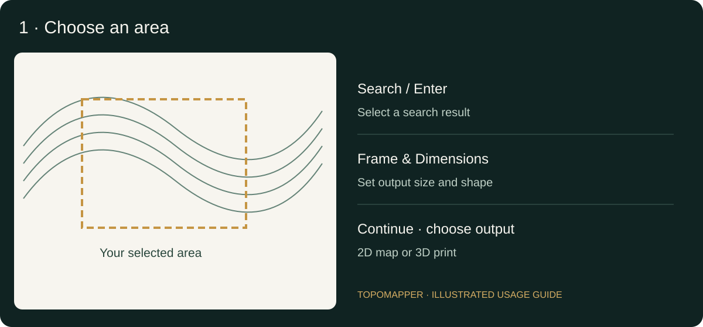
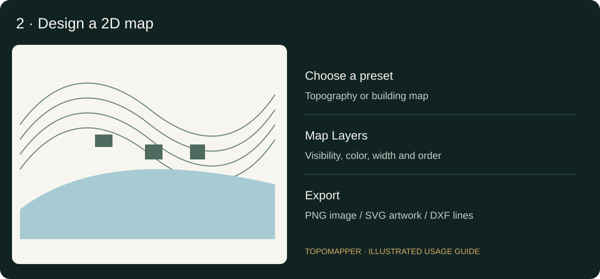
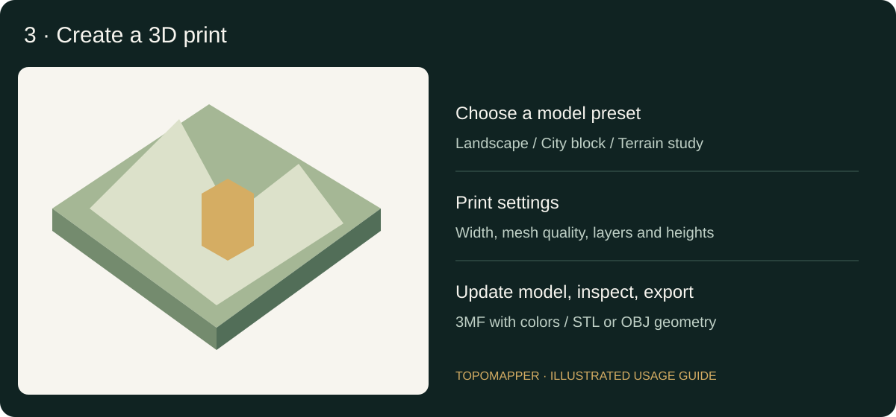

# Topomapper

Create printable 2D maps and 3D landscape models from places around the world, directly in your browser.

[Open Topomapper](https://zrnnn.github.io/topomapper/) · Current release: **0.2.0**

## What is new in 0.2.0?

- A simpler area-first workflow: select **2D map** or **3D print**, then choose exactly which data layers to load with clear on/off switches.
- A single responsive workspace toolbar for area selection, 2D/3D preview, export, zoom controls and detailed progress.
- Faster whole-city mapping through adaptive OpenFreeMap vector tiles, bounded geometry, caching and automatic level-of-detail selection.
- More reliable worldwide terrain with Mapzen, Mapterhorn and Open-Elevation fallbacks.
- Raised 3D buildings, class-scaled roads, water, green areas and rivers in printable 3MF, STL and OBJ models.
- A print-aware 3D pipeline that omits sub-0.2 mm details, supports 10–500% terrain relief and validates fused printable solids before download.
- Improved water and coastline handling, layer ordering, preview pan/zoom, in-interface warnings and recoverable partial results.
- A muted earth-tone interface, improved responsive layouts and an updated Topomapper identity.

See the [release verification notes](docs/RELEASE-REVIEW.md) for tested behavior and remaining limitations.

## Workspace navigation and live progress

The centered workflow bar lets you return to **Select area**, switch between **2D preview** and **3D preview** using the loaded area, or open **Export**. Unavailable steps are visibly disabled; hover over one to see why. Returning to area selection preserves the existing preview until you generate another area.

One central toolbar combines workflow steps, zoom controls and live progress. Its **Layers** button returns to the inline data-selection panel; **Tools** groups 2D undo, redo and automatic-preview controls. The status section shows the current task and elapsed time, with a detail line for provider connections, real downloaded bytes, cached data, mirror attempts, geometry generation and file preparation. Percentages indicate processing stages, not an estimated time remaining. Downloads show an unknown total when the provider does not supply a reliable decoded byte count. Printable 3D downloads still require **Prepare printable model**.

## What can I make?

- Paper maps and posters with terrain shading, contour lines, buildings, roads and water.
- SVG and DXF artwork for vector editing, CAD and laser preparation.
- 3D terrain and city models with raised buildings and selected map layers, downloadable as 3MF, STL or OBJ.

No account or API key is required. Internet access is needed to search for places and download elevation and map data. Rendering and file generation run in your browser.

## Step 1: Choose an area

Type a place in **Location Search**, then press **Enter** or **Search**. Select a result and move or zoom the map until the frame covers your desired area.

Open **Frame & Dimensions** to adjust the output width, height and shape. Dimensions describe the final output in millimetres. Map zoom controls how much real-world geography fits into that output.

Choose **Continue · choose layers**, then **2D map** or **3D print** in the sidebar. Use simple on/off switches for terrain, water, green areas, rivers, roads, smaller streets, buildings and 2D place names. Press **Load selected layers** when ready. Nothing is downloaded by the mode buttons themselves. Start with a small neighbourhood when you want detailed buildings.

Whole-city source detail is automatic above 25 km²; there is no separate mode to configure. Buildings and smaller streets have conservative defaults on large selections, but remain available as normal switches. The warning becomes stronger when requested buildings exceed 25 km² in 3D or 80 km² in 2D, or smaller streets exceed 40 km². Heavy selections can take minutes, time out or exhaust browser memory. These warnings do not silently change your choices; hard download and geometry budgets still protect the browser.

Terrain detail adapts to area and output dimensions: small selections use finer samples, large areas use fewer, and larger output sizes request more. Primary sampling stays between 96 and 320 points per side (the emergency Open-Elevation fallback uses 64). New selections also adjust the initial 3D mesh quality and minimum building size; advanced controls remain editable. Zooming the preview does not download new data; select a smaller map area and generate again for more source detail. Increase the output size and regenerate if previously omitted features are needed.

Turning terrain off skips elevation requests and creates a flat base. Unselected overlays do not generate Overpass queries or processing stages. Shared city tiles contain several layers in one file, so choosing fewer layers reduces decoding work but not necessarily tile download bytes. Presets cannot re-enable layers that were not requested; use **Layers** to request them.

Requested terrain appears as soon as it is ready. Selected map data then loads in recoverable stages: water and green areas, rivers, roads, then buildings. If a later stage fails, earlier successful layers remain available and the exact provider error is shown. City overview uses prepared OpenFreeMap vector tiles for water, green areas, rivers, roads and place names, with detail selected from the map extent and output size. It downloads at most 16 tiles, with up to three concurrent requests. Small-area detail and requested buildings use Overpass. City tiles are generalized; they do not recover features omitted at the selected source zoom. Terrain uses 128 × 128 samples at the standard city output size and the 3D preset starts with a Draft mesh. After projection, overview geometry is simplified to a hard 60,000-point display budget (120,000 in detailed mode), based on physical output dimensions rather than browser zoom.

Overpass starts with one query per stage. Only size-related failures trigger subdivision, with a maximum of 16 fallback sections and one subdivision level. Quotas, timeouts and outages do not multiply into smaller requests. Decoded responses are bounded before parsing: 8 MB per Overpass response, 4 MB per vector tile, and 24 MB downloaded per map-layer operation. Overpass's separate `maxsize` setting limits server working memory; it is not a download-size limit.

Successful geographic responses and terrain tiles are cached independently of styling and print dimensions. **Retry map layers** reuses successful requests and downloads missing data. When browser storage is available, cache entries survive reloads for up to 24 hours, bounded to 64 MB and 128 entries; an additional memory cache is capped at 32 MB. Private mode or denied storage falls back to memory caching. Browser site-data controls can clear the persistent cache.

Area generation uses a shared **five-minute** deadline, including terrain, selected map details and the initial preview. Terrain has up to 100 seconds; map stages have up to 100 seconds each, within the remaining overall budget. Overpass processing allows 30 seconds, with a 45-second request limit to leave transfer time. This is a cancellation budget, not a promise of complete coverage or predictable loading speed. Printable-model preparation is a separate explicit operation with its own **three-minute** limit. Expand **Loading details** for stage timings, downloaded bytes, point counts and the source used.



*The three illustrations in this guide explain the workflow; they are not screenshots or real geographic data.*

## Step 2: Design a 2D map

Choose a preset in **2D preview**:

| Preset | Suggested use |
| --- | --- |
| Alpine Atlas | Balanced topographic maps |
| Urban Figureground | Buildings and urban layout |
| Midnight Blueprint | Dark building-map artwork |
| Contour Study | Minimal elevation linework |
| Shaded Landscape | Shaded raster posters |
| Laser Linework | Vector outlines for CAD or laser preparation |

Under **Map Layers**, toggle contours, buildings, roads, rivers, water areas, green areas and place names. Expand a layer to change its appearance. Roads remain one interface layer, while motorway, trunk, primary, secondary, tertiary and local classes receive progressively thinner strokes in preview, SVG and 3D. DXF separates the road classes into named layers so CAD line weights can be adjusted. Move visual layers with arrows or drag handles; layers at the top draw above those below. Presets place contour lines above area fills. Transparent fills reveal lower layers; terrain shading stays at the bottom. The same order is used for the 2D preview, PNG and SVG. In 3D, physical height and camera position determine visibility.

Line widths use millimetres. **Bold Every Nth** emphasizes selected contours; 0 disables emphasis. Adjust density and smoothing to balance detail and readability.

Zoom the preview with the mouse wheel or **− / + / Fit**, and drag the preview to move around it. The interactive 2D preview is a raster canvas capped at twice the viewport width and height, and zoom is limited to 2×. Dragging and zooming reuse that canvas. PNG export resolution is independent, and SVG/DXF retain vector geometry. Preview zoom does not change export dimensions. Turn **Auto Preview** off while making several expensive changes, then choose **Update preview**. Undo and redo apply to design changes.



### Large building datasets

**Minimum footprint (mm²)** removes buildings that would be too small in the final output. A 1 × 1 mm footprint has an area of 1 mm². Complex outlines are simplified, and dense selections retain up to 2,500 of the largest buildings. The interface reports omissions.

A threshold of 0 disables the small-footprint filter, but the count limit and outline simplification still apply. Neighbouring buildings are not merged into city blocks.

### Export a 2D map

Choose **Continue to Export** or the **Export** tab.

| Format | Purpose | Output |
| --- | --- | --- |
| PNG | Paper, posters and image editing | Raster image; higher resolution uses more memory |
| SVG | Vector editing and scalable artwork | Vector paths, with optional embedded raster shading |
| DXF | CAD and laser preparation | Editable linework in millimetres, not a shaded image |

Check laser paths in your machine software. When printing paper maps, use the intended scale rather than automatic page fitting.

## Step 3: Create a 3D print

Choose **Landscape model** for terrain with map layers, **City block** for a flat base, **City overview** for a lighter whole-city model, or **Terrain study** for terrain alone.

Set print width and mesh quality, then select terrain, buildings, streets, water areas, rivers and green areas. Advanced controls include base thickness, terrain vertical scale, building-height scale, fallback height, minimum building footprint, and raised-layer dimensions. Terrain vertical scale ranges from 10% to 500%: **100% preserves the real terrain proportion at the chosen print width**, lower values flatten the landscape, and higher values exaggerate relief.

A **quick preview** appears automatically and updates after you change settings. It uses separate surfaces and a lighter terrain mesh, avoiding expensive solid fusion while editing. Drag to orbit, scroll or use **− / +** to zoom, and choose **Reset view** to restore the camera.

Choose **Prepare printable model** when you are ready. This runs full mesh preparation, fuses the selected layers and validates the solid. Download becomes available only after preparation succeeds. Quick-preview geometry cannot be exported accidentally. Changes invalidate the prepared result; preparing unchanged settings can reuse the cached solid.



| Format | Contents |
| --- | --- |
| 3MF | Geometry, millimetre units and face colors |
| STL | Geometry only; choose millimetres when importing |
| OBJ | Geometry only; confirm scale in the receiving application |

Selected layers are fused into a solid. Water and green areas are raised surfaces, not automatically carved channels. Buildings use mapped height, then floor count × 3 metres, then your fallback height. Roofs are flat. Terrain vertical scale and building exaggeration have separate controls; the model status reports the resulting elevation range in millimetres.

Inspect scale, minimum features, supports and colors in your slicer. Face colors do not guarantee automatic multi-material slicing. These are simplified cartographic models, not survey data or detailed architectural replicas.

For standard FDM printability, 3D footprints whose smallest X or Y dimension is below 0.2 mm are omitted after scaling. Raised street widths are also kept at a minimum of 0.2 mm. This rule affects the model, not high-resolution 2D exports.

## Loading and troubleshooting

Loading panels show elevation, map layers and preview stages. Model generation and export show their current operation. Warnings, recovery prompts and technical error details stay inside the interface rather than opening browser popups. Percentages describe workflow progress, not time remaining.

- **Request failed or timed out:** retry, check your connection or select a smaller area.
- **Elevation unavailable:** the app tries a lower-resolution fallback source.
- **Map layers missing:** terrain and any successful earlier stages remain available. Use **Retry map layers** inside the preview to reload the same area. The app tries alternate services and smaller sections automatically, within the remaining shared area-generation deadline. For 3D, disable unavailable overlays to generate terrain only.
- **Provider quota or rate limit:** the app shows the returned HTTP status or Overpass remark, temporarily cools down that provider, and tries another. Wait and retry, reduce detail, or enter an HTTPS Overpass-compatible endpoint under **Frame & Dimensions**.
- **Selection too detailed:** increase the minimum building footprint, lower mesh quality, disable dense layers or choose a smaller area.
- **Model/export failure:** follow the displayed action and inspect technical details. The previous successful result is preserved.

Generation can be cancelled. Export before closing or reloading: project save/restore is not implemented.

## Coverage and limitations

Water Areas includes lakes, reservoirs, ponds, basins, lagoons and bays. Rivers is a separate layer. Multipolygons can retain courtyard and island holes.

City vector tiles include sea/ocean polygons. In detailed Overpass mode, coastal water is derived from directed shorelines, including same-edge crossings, multiple bays and island holes. Fully offshore frames without a shoreline cannot be inferred by that fallback. Incomplete or inconsistent source geometry may require a smaller selection.

Other limits include 40–240 mesh samples per side, 50–400 mm 3D print width, 2,500 retained buildings, geometry-size limits, a five-minute area-generation budget and a separate three-minute printable-model preparation limit. Heavy layer selections can still exceed browser capacity. Building heights and map coverage vary by location.

## Data, privacy and credits

Search terms are sent to public Nominatim. Detailed map bounds are sent to Overpass; city tile coordinates are sent to OpenFreeMap. Elevation tile requests go to Mapzen, then Mapterhorn if needed; the final fallback sends sample coordinates to Open-Elevation. These services receive normal request information, including your IP address.

The browser may retain bounded caches of the selected geography for repeat visits. The app also loads basemap tiles from OpenTopoMap and fonts from Google Fonts. These providers receive normal browser requests. The app has no account system or application backend. Public services have no availability guarantee.

Map fallback uses the three currently documented public, no-key operators with global OpenStreetMap coverage: Private.coffee (formerly Kumi), FOSSGIS Overpass, and VK Maps. Private.coffee is the initial default; successful request timings then rank the non-Russian public providers, with VK Maps (`maps.mail.ru`) always last. Rankings use a rolling average within the active map worker, without extra quota-consuming probes; they are not a worldwide speed guarantee. A custom endpoint always takes priority. Provider names appear during loading. Rate-limited providers are temporarily skipped; the app honors numeric or date-form Retry-After headers with at least a 30-second cooldown. Advanced users can put a self-hosted or API-key Overpass-compatible HTTPS endpoint first in the fallback pool under **Frame & Dimensions**. [Provider coverage and usage policies](https://wiki.openstreetmap.org/wiki/Overpass_API#Public_Overpass_API_instances).

Worldwide coverage is subject to available source data. This Web Mercator application supports selections between 85°S and 85°N and does not support date-line-crossing frames. Changing an API server does not create missing building geometry or improve the source elevation resolution. Terrain tries Mapzen, then [Mapterhorn's 512-pixel Terrarium tiles](https://mapterhorn.com/data-access/), then Open-Elevation. Mapterhorn uses globally available zoom levels up to 12; its regional higher-zoom archives are not required.

City geometry uses [OpenFreeMap](https://openfreemap.org/) and © [OpenMapTiles](https://openmaptiles.org/). Map features are © [OpenStreetMap contributors](https://www.openstreetmap.org/copyright). Basemap cartography is © [OpenTopoMap](https://opentopomap.org/about). Elevation uses [Mapzen terrain tiles](https://registry.opendata.aws/terrain-tiles/) with [source credits and licence terms](https://github.com/tilezen/joerd/blob/master/docs/attribution.md). The Mapterhorn fallback has additional [source credits and licence terms](https://mapterhorn.com/attribution/). Preserve applicable credits when sharing exports.

### Other provider options

The public provider list was reviewed on 20 September 2026. Kumi and Private.coffee are the same operator, not independent mirrors. Regional servers are not worldwide fallbacks. Key-based Overpass-compatible services from [Geofabrik](https://www.geofabrik.de/), [FairwayMapper](https://www.fairwaymapper.com/) and other operators listed in the [OSM provider directory](https://wiki.openstreetmap.org/wiki/Overpass_API#Public_Overpass_API_instances) can be used through the advanced custom HTTPS endpoint if your plan permits this use and supports browser CORS. No keys are bundled. Do not publish private keys in the repository; a static browser app cannot conceal a client-side key.

[Maptoolkit](https://www.maptoolkit.org/) was not added: its free service excludes print materials and data extraction, which conflicts with this tool's exports. Public-service capacity is finite; adding aliases or parallel retries does not remove usage limits.

## Development

Requires Node.js 22.12 or later; CI uses Node 24.

```sh
npm ci
npm run dev -- --host 127.0.0.1
```

To test and preview the production build:

```sh
npm test
npm run build
npm run preview -- --host 127.0.0.1 --port 4173
```

Open http://127.0.0.1:4173/topomapper/ for the production preview.

## GitHub Pages

The static build is written to `build/`; the production base path is `/topomapper`. Set the repository's Pages source to **GitHub Actions**.

A push to `main` runs tests and builds the site, then deploys the Pages artifact. Check the deployment job and the published URL after release. Development branches and pull requests run verification without deploying Pages.

If the repository name changes, update the base path in `svelte.config.js`.

## Code layout

- `src/routes/+page.svelte`: interface
- `src/lib/topomapper.js`: map selection, 2D design and export
- `src/lib/model*.js`: 3D workflow, geometry and export
- `src/lib/terrain*.js`: elevation processing
- `src/app.css`: shared styling
- `tests/`: geometry, worker and stability checks
- `legacy/`: historical implementation, not the current app

See [LICENSE](LICENSE) for the project licence.
